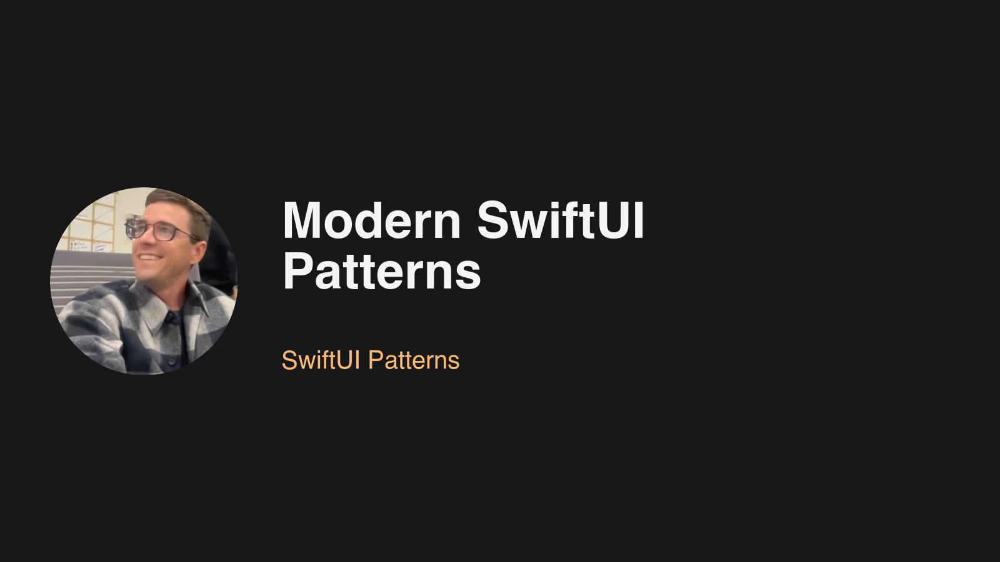

# SwiftUIBuilder

An Xcode project for building real SwiftUI features from scratch. Each exercise gives you a working mock API and a target screen — you implement it using modern SwiftUI patterns.

Companion to the **[Modern SwiftUI Patterns](https://pixelper.com/blog/swiftui-patterns-intro)** series on [pixelper.com](https://pixelper.com/blog).

**Requires:** Xcode 15+, iOS 17+

---

## Getting Started

```bash
git clone https://github.com/christopherkmoore/SwiftUIBuilder.git
cd SwiftUIBuilder
open SwiftUIBuilder.xcodeproj
```

Or regenerate with XcodeGen:
```bash
brew install xcodegen && xcodegen generate
```

---

## Exercises

### Lists

**Loading & Error States** — A user list that goes through loading, error, and empty states. Uses `ContentUnavailableView` for both the error (with a retry button) and the empty case. Data loads via `.task` on appear.
> [Building Robust Lists: Loading & Error States](https://pixelper.com/blog/swiftui-list-loading-error-states) · [ContentUnavailableView for Empty States](https://pixelper.com/blog/swiftui-content-unavailable-view)

**Pull-to-Refresh** — A post list with `.refreshable`, showing a "last updated" timestamp formatted as a relative date using `Text(.relative(to:))`.
> [Pull-to-Refresh with .refreshable](https://pixelper.com/blog/swiftui-pull-to-refresh) · [Displaying Relative Dates](https://pixelper.com/blog/swiftui-relative-dates)

**Search & Filter with Debounce** — A product list with a debounced search field (300ms), a category picker, and an "in stock only" toggle. Cancels the previous search task before starting a new one.
> [Search & Filter with Debouncing](https://pixelper.com/blog/swiftui-search-debouncing) · [Multi-Filter Product Lists](https://pixelper.com/blog/swiftui-multi-filter-list)

---

### Grids

**Adaptive Grid with List/Grid Toggle** — A product grid using `GridItem(.adaptive(minimum: 150))` that adapts to screen width. Toggles to a list layout with a smooth opacity transition.
> [Photo Galleries with LazyVGrid](https://pixelper.com/blog/swiftui-lazyvgrid-gallery) · [Adaptive Grids for Responsive Layouts](https://pixelper.com/blog/swiftui-adaptive-grid) · [Animating Grid/List Mode Transitions](https://pixelper.com/blog/swiftui-grid-list-toggle)

**3-Column Photo Grid** — A fixed 3-column grid with `ZStack` title overlays using `.ultraThinMaterial`, category filtering via a segmented picker, and a detail sheet on tap.
> [Sheet-Based Detail Views](https://pixelper.com/blog/swiftui-sheet-detail-views)

---

### Navigation

**Modal Presentations** — A product list that uses all five modal patterns: `sheet`, `fullScreenCover`, `confirmationDialog`, `alert`, and sheet-to-fullscreen transitions. Data flows back from the sheet via a closure.
> [Complete Guide to Modal Presentations](https://pixelper.com/blog/swiftui-modal-presentations) · [Confirmation Dialogs & Swipe Actions](https://pixelper.com/blog/swiftui-confirmation-swipe) · [Passing Data Back from Modals](https://pixelper.com/blog/swiftui-modal-data-passing)

**Master-Detail with NavigationStack** — A user list that navigates to a detail view showing the user's profile and posts. Both levels load their own data asynchronously and handle loading, error, and empty states independently.
> [Master-Detail with NavigationStack](https://pixelper.com/blog/swiftui-master-detail) · [Value-Based NavigationLink](https://pixelper.com/blog/swiftui-navigationlink-value)

---

### State

**Form Validation** — A registration form with real-time validation across text fields, a secure field, picker, stepper, and toggle. The submit button stays disabled until all fields pass. Includes a password strength meter (weak / medium / strong) with regex and scoring logic.
> [Real-Time Form Validation](https://pixelper.com/blog/swiftui-form-validation) · [Password Strength Indicators](https://pixelper.com/blog/swiftui-password-strength)

**Shared State with EnvironmentObject** — A `CartManager` owned by a parent view and injected as an `@EnvironmentObject`. Child views add and remove items; a cart badge in the toolbar updates live. A modal sheet shows the full cart with editing and checkout.
> [@StateObject vs @ObservedObject](https://pixelper.com/blog/swiftui-stateobject-vs-observedobject) · [Building a Shopping Cart with EnvironmentObject](https://pixelper.com/blog/swiftui-shopping-cart)

---

[pixelper.com](https://pixelper.com) · [Blog](https://pixelper.com/blog)
